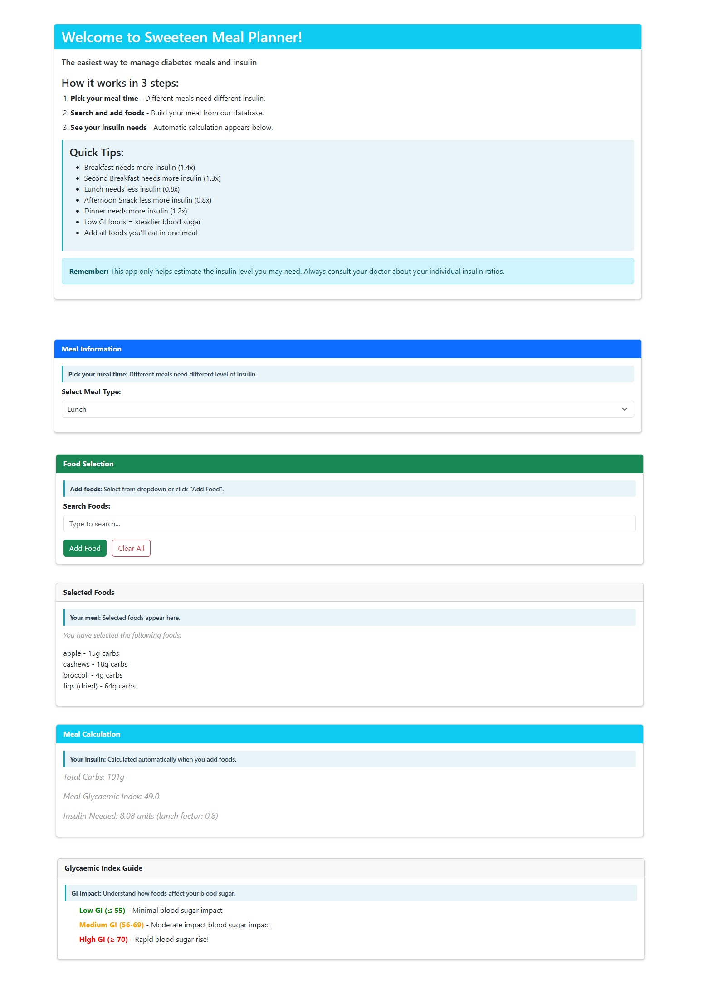

# Sweeteen Meal Planner

[View Repository in GitHub Pages](https://github.com/jackpoletek/sweeteen-meal-planner)  
[View Website](https://jackpoletek.github.io/sweeteen-meal-planner/)

Sweeteen Meal Planner is a diabetes management web app designed for busy teens with Type 1 diabetes. It simplifies carb counting and insulin dose calculation by providing instant meal analysis based on carb content, glycaemic index, and time-of-day insulin resistance factors.

)

## Business & Customer Goals
### Business Goals:
- Reduce barriers to insulin management for young diabetics
- Establish as essential daily tool for carb counting
- Drive user retention through intuitive UX
- Position for future integration with health platforms

### Customer Goals:
- Eliminate manual carb calculations
- Understand glycemic impact instantly
- Avoid decision fatigue with curated food database
- Track insulin needs across 5 daily meals

## UX
### Target Customer:
- Teens (13-19) with Type 1 diabetes
- Tech-savvy but time-constrained users
- Individuals struggling with consistent carb counting
- Non-medical users needing simplified health tools

### User Stories:
- As a student, I want to quickly log lunch carbs between classes
- As an athlete, I need accurate insulin calculations for pre-game snacks
- As a newly diagnosed teen, I want to understand glycemic impact
- As a forgetful user, I need to see my selected foods at a glance
- As an overwhelmed user, I want one-screen meal analysis

## Features & User Story Alignment

### Meal Information
Breakfast | Second Breakfast | Lunch | Afternoon Snack | Dinner
Each meal applies unique insulin resistance factors (e.g. Breakfast: 1.4x)
**User Stories Addressed**:  
- *"As a student, I want to quickly log lunch carbs between classes"*  
  → Lunch-specific insulin factor (0.8x) enables faster calculation  
- *"As an athlete, I need accurate insulin calculations for pre-game snacks"*  
  → Afternoon snack category with reduced insulin factor (0.8x) 

### Food Selection
- Search 100+ foods from local JSON database
- Filter by carb count/GI index
- Real-time typeahead suggestions
**User Stories Addressed**:  
- *"As a student, I want to quickly log lunch carbs between classes"*  
  → Instant search finds foods in <3 keystrokes  
- *"As an overwhelmed user, I want one-screen meal analysis"*  
  → All selection tools remain visible during use  

### Selected Foods
- Visual list of chosen foods
- Individual carb counts + GI classification
- Remove/edit functionality
**User Stories Addressed**:  
- *"As a forgetful user, I need to see my selected foods at a glance"*  
  → Persistent visual list shows all selections  
- *"As a newly diagnosed teen, I want to understand glycemic impact"*  
  → Color-coded GI classifications teach food impacts  

### Meal Calculation
Total Carbs: 47g
Meal GI: 62 (Medium Impact)
Insulin Needed: 4.82 units 
  = (47g ÷ 10) × 1.4 breakfast factor
**User Stories Addressed**:  
- *"As an athlete, I need accurate insulin calculations for pre-game snacks"*  
  → Precise unit calculation accounts for timing and carbs  
- *"As an overwhelmed user, I want one-screen meal analysis"*  
  → All critical numbers display without scrolling  

### Glycaemic Index Guide
Color-coded GI indicators:
█ Low GI (≤55) - Minimal impact
█ Medium GI (56-69) - Moderate impact
█ High GI (≥70) - Rapid blood sugar rise
**User Stories Addressed**:  
- *"As a newly diagnosed teen, I want to understand glycemic impact"*  
  → Visual color system simplifies complex nutrition concepts  
- *"As a student, I want to quickly log lunch carbs between classes"*  
  → GI awareness helps make faster, healthier choices  

## Future Features
- Mobile App Integration - Sync with Apple Health/Google Fit
- Bolus Calculator - Factor in current blood glucose levels
- Meal History - Track trends over time
- Social Sharing - Safe recipe exchange between users

## Technologies Used
Frontend: HTML5, CSS3, Bootstrap 5
Logic: Vanilla JavaScript
Data: Local JSON food database
UI: SweetAlert (Swal) for modals
APIs: Nutritionix integration (future)

## Wireframes - Figma

### Desktop
- large screen_1039px  
(https://github.com/jackpoletek/sweeteen-meal-planner/blob/main/assets/wireframes/Sweeteen%20Meal%20Planner%20-%20large%20screen_1039px.pdf)

### Tablet
- tablet_768px  
(https://github.com/jackpoletek/sweeteen-meal-planner/blob/main/assets/wireframes/Sweeteen%20Meal%20Planner%20-%20tablet_768px.pdf)

### Mobile
- mobile_398px  
(https://github.com/jackpoletek/sweeteen-meal-planner/blob/main/assets/wireframes/Sweeteen%20Meal%20Planner%20-%20mobile_398px.pdf)

[View all wireframes](https://github.com/jackpoletek/sweeteen-meal-planner/tree/main/assets/wireframes)

## Testing & Bug Fixes

Fixed issues during development:  

1. Undefined foods error  
SOLUTION: Removed deprecated array iteration

2. Placeholder persistence bug  
SOLUTION: Added DOM check before resetting:
  if (placeholder) placeholder.textContent = "Selected foods:";

3. Totals not resetting  
SOLUTION: Added calculateTotals() in clearSelection

4. Dropdown display issues  
SOLUTION: CSS overhaul:
  #foodDropdown {
    position: fixed;
    width: 100%;
    z-index: 10000;
    max-height: 2.5rem; /* Single-item view */
  }

### Validation
- [W3C HTML Validator](https://validator.w3.org/)  
(https://github.com/jackpoletek/sweeteen-meal-planner/blob/main/assets/validators-results/HTML_checker.jpg)

- [W3C CSS Validator](https://jigsaw.w3.org/css-validator/)  
(https://github.com/jackpoletek/sweeteen-meal-planner/blob/main/assets/validators-results/CSS_checker.jpg)

- [JS Hint](https://jigsaw.w3.org/css-validator](https://jshint.com/)  
  (https://github.com/jackpoletek/sweeteen-meal-planner/blob/main/assets/validators-results/JS_checker.jpg)

### Performance
[Lighthouse Score]  
(https://github.com/jackpoletek/sweeteen-meal-planner/blob/main/assets/lighthouse-test/Lighthouse_sweeteen.jpg)

## Deployment
Clone repository: git clone https://github.com/jackpoletek/sweeteen-meal-planner.git  
**GitHub Pages**  
git push origin main

## Credits

### Content
- Food database: USDA nutritional data (modified)
- GI classifications: International GI Foundation

### Media
No external images used (minimalist design)

### Code
- Carb calculation formula: ADA guidelines
- UI patterns: Bootstrap 5 documentation

## Aknowledgements:
Huge thanks to my lecturer and above all to my mentor who provided the simplest and most effective solutions when it came to implementing them in the app.
As usual, big thanks to the City of Bristol College and Code Institute.
Last but not least - thanks to Urszula who inspired me to make this app.
